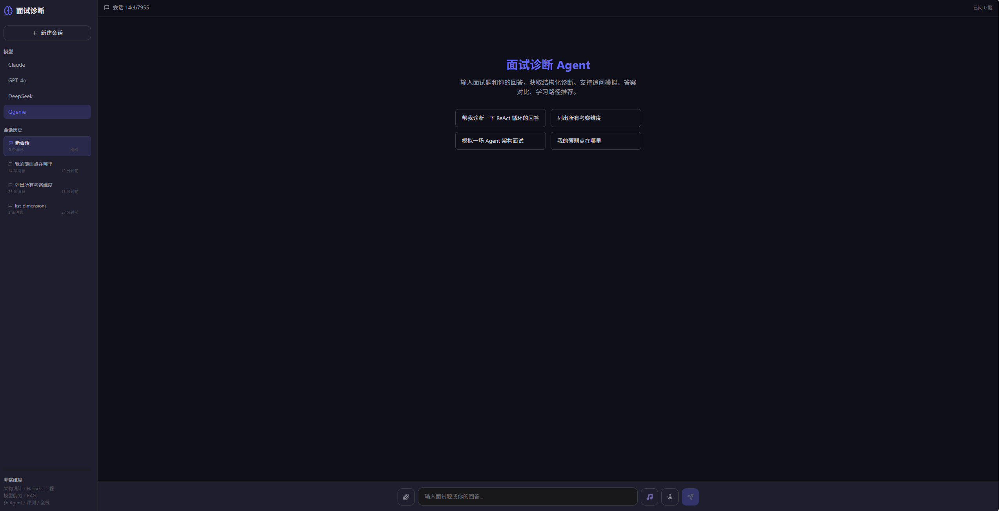
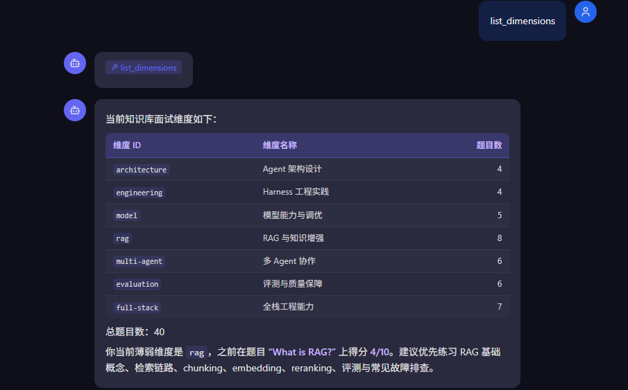
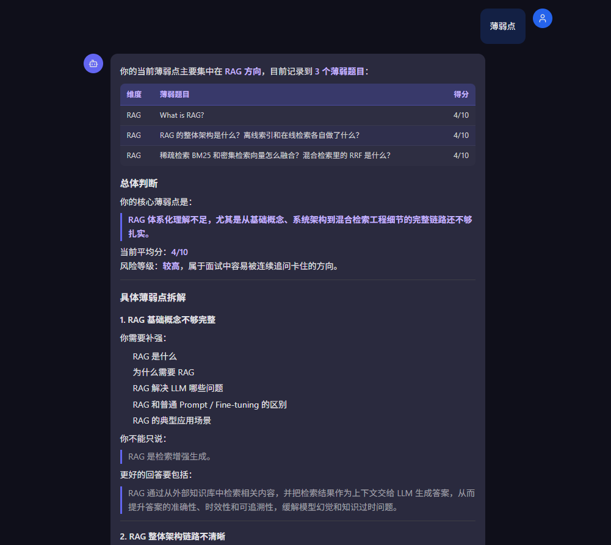
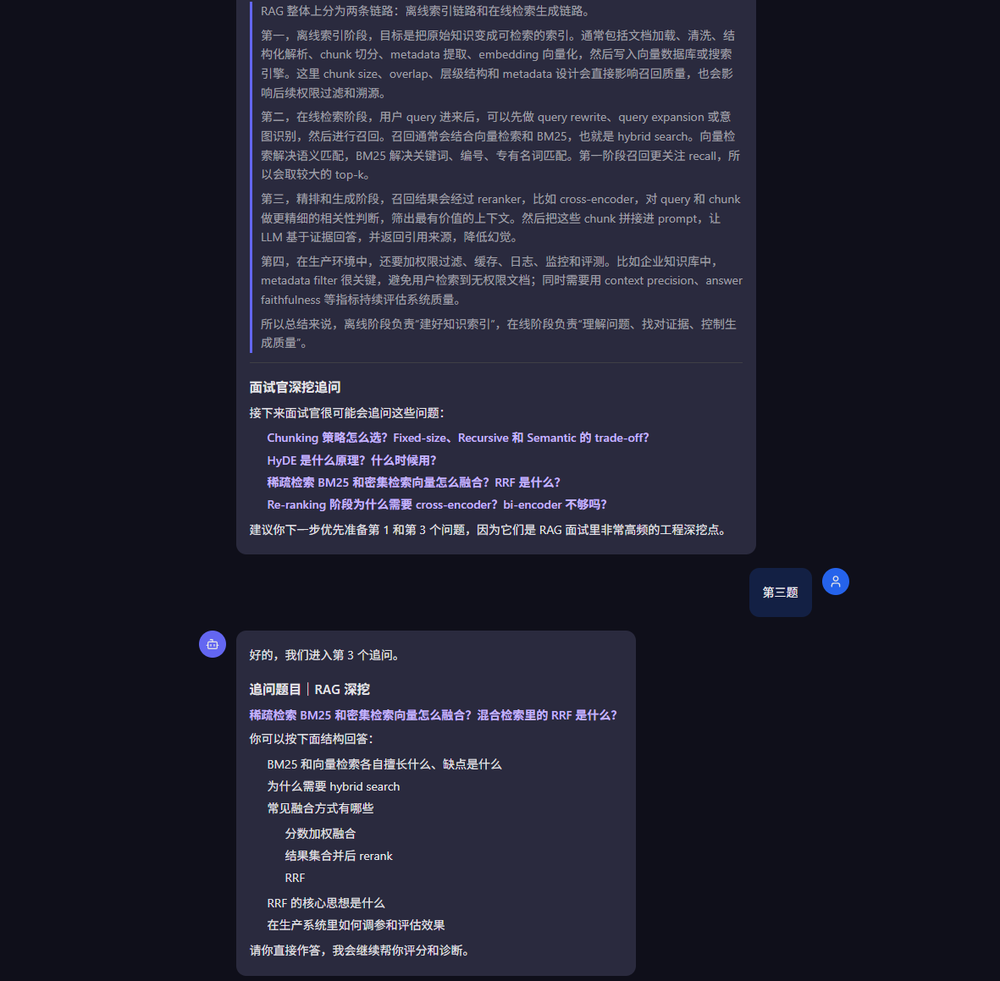

# OfferClaw — AI 全链路求职辅导 Agent

> 纯手写 Agent Loop，不依赖 LangChain / LangGraph，完整实现 10 层 Harness 工程架构

[](LICENSE)
[](https://nodejs.org/)
[](https://www.typescriptlang.org/)
[](https://nextjs.org/)

---

## 项目简介

OfferClaw 是一个面向 AI Agent / LLM 工程方向求职者的全链路辅导系统。核心特点：

- **纯手写 Agent Loop** — 不依赖任何 Agent 框架，完整实现从 Query Engine 到 Sub-agent 的每一层
- **知识库驱动** — 300+ 道真实大厂面试题，覆盖 7 个核心考察维度，SQLite FTS5 全文检索
- **持久化记忆** — 每次诊断结果写入 SQLite，跨会话追踪薄弱点，二次作答自动更新分数
- **Web UI** — Next.js 14 + SSE 流式输出，多会话管理，支持文件上传和语音输入

---

## 界面截图



<table>
  <tr>
    <td width="50%">
      
      <p align="center"><sub>知识库维度 — 实时统计各维度题目数量</sub></p>
    </td>
    <td width="50%">
      
      <p align="center"><sub>薄弱点分析 — 跨会话追踪，维度级学习报告</sub></p>
    </td>
  </tr>
  <tr>
    <td colspan="2">
      
      <p align="center"><sub>模拟面试 — 从知识库抽题，流式输出诊断结果</sub></p>
    </td>
  </tr>
</table>

---

## 功能模块

| 模块 | 能力 |
|:---|:---|
| 🎯 面试诊断 | 输入面试题 + 回答 → 评分 + 差距分析 + 改进建议 |
| 📋 JD 分析 | 贴入 JD → 技术栈提取 + 职级判断 + 面试准备重点 |
| 📝 简历优化 | 段落级诊断：量化度 / STAR 结构 / 关键词覆盖 |
| 🔗 简历-JD 匹配 | 关键词覆盖率 + 缺失项 + 定向包装建议 |
| 🎲 模拟面试 | 从知识库按维度抽题，难度可选 |
| 🎙️ 实时面试模拟 | TTS 提问 → 实时缺陷检测 → 逐题反馈 → 总结报告 |
| 📊 薄弱点追踪 | 跨会话记录每道题得分，生成维度级学习报告 |

---

## 快速开始

```bash
git clone https://github.com/yao-li57/OfferClaw.git
cd OfferClaw

# 安装依赖
npm install

# 配置 API Key（至少配一个）
cp .env.example .env
# 编辑 .env 填入 key（支持 Claude / OpenAI / DeepSeek / 自定义 OpenAI 兼容端点）

# 构建知识库索引
npm run build-kb

# 启动后端
npm run server

# 启动 Web UI（新终端）
cd web && npm install && npm run dev
# 访问 http://localhost:3000
```

---

## 架构设计

```
┌─────────────────────────────────────────────┐
│               Agent Loop                    │
├─────────────────────────────────────────────┤
│  Query Engine  │  Context Manager  │  Memory │
├─────────────────────────────────────────────┤
│  Tool Registry  │  Permission Gate  │  Hooks  │
├─────────────────────────────────────────────┤
│  Session Manager  │  Command Parser          │
├─────────────────────────────────────────────┤
│              Sub-agent Runtime               │
└─────────────────────────────────────────────┘
```

### 技术栈

| 层级 | 选型 |
|:---|:---|
| LLM 调用 | `@anthropic-ai/sdk` + `openai` SDK（无框架直调） |
| 支持模型 | Claude / GPT-4o / DeepSeek / 任意 OpenAI 兼容端点 |
| 运行时 | Node.js 18+ + TypeScript 5.5 (ES2022 ESM) |
| 数据库 | better-sqlite3（会话 / 记忆 / 知识库） |
| 知识检索 | SQLite FTS5 全文检索 + LIKE 混合搜索 |
| 前端 | Next.js 14 + Tailwind CSS + SSE 流式 |

---

## 目录结构

```
src/
├── agent/           # Agent Loop 核心循环
├── query-engine/    # LLM 调用层（多 Provider + 重试 + 路由）
│   └── providers/   # Claude / OpenAI / DeepSeek / Mock
├── tools/
│   └── builtin/     # 13 个内置工具（诊断 / JD / 简历 / 模拟面试）
├── context/         # 5 层上下文 + 3 级压缩
├── memory/          # SQLite 持久化记忆
├── session/         # 会话状态机 + SQLite 持久化
├── permission/      # 风险分级权限控制
├── hooks/           # Hook 管线（pre/post-tool）
└── db/              # SQLite schema 与连接
knowledge/           # 面试题知识库（Markdown → SQLite FTS5）
web/                 # Next.js Web UI
└── src/
    ├── app/api/     # SSE 聊天 / 会话 / 文件上传 / 语音转写
    └── components/  # Sidebar / ChatMessage / ChatInput
```

---

## 环境变量

```env
# 至少配置一个 LLM provider
ANTHROPIC_API_KEY=sk-ant-...
OPENAI_API_KEY=sk-...
DEEPSEEK_API_KEY=sk-...

# 自定义 OpenAI 兼容端点（三项都填才启用，优先级最高）
LLM_BASE_URL=https://your-endpoint/v1
LLM_API_KEY=your-key
LLM_MODEL=your-model-name
```

---

## License

[MIT](LICENSE) © [yao-li57](https://github.com/yao-li57)
